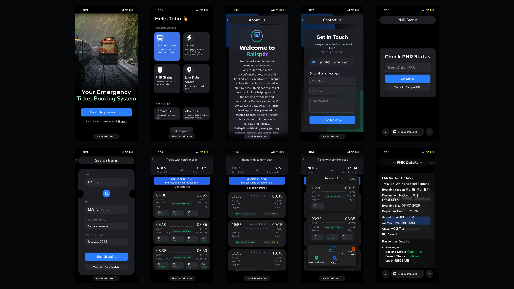
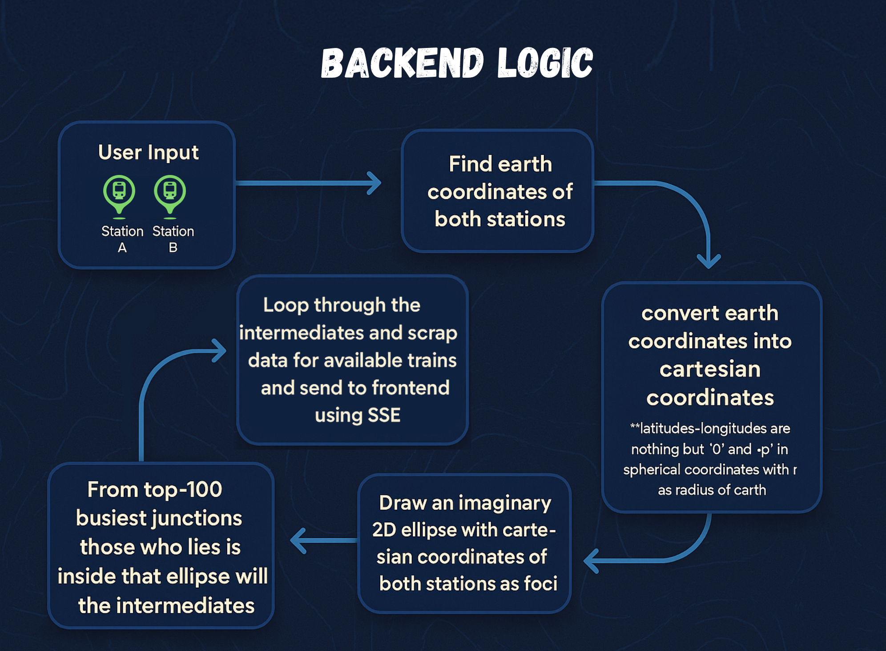

# 🚂 RailSplit - Smart Split Journey Discovery for Indian Railways


RailSplit is an intelligent web application designed to solve a major pain point for Indian Railways travelers: **the lack of confirmed tickets on long-distance routes**. By leveraging Cartesian geometry and an optimized search algorithm, RailSplit finds alternative split journeys—dividing a long trip into two consecutive legs via an intermediate junction—significantly increasing the likelihood of finding available, confirmed, or RAC seats.

---

## 🚀 Live Demo

👉 **[railsplit.luckylinux.dev](https://railsplit.luckylinux.dev)**

---

## 📱 App Preview



---

## 🧩 Backend Logic



### Flow Breakdown:
1. **Coordinates Conversion:** The app converts Latitude/Longitude coordinates into 3D Cartesian coordinates to accurately plot junctions on a 2D plane.
2. **Cartesian Ellipse Foci:** An ellipse is drawn utilizing the source and destination stations as the two focal points. This restricts the intermediate search space to logical junctions along the path of travel.
3. **Candidate Filtering:** Stations from a pre-defined database of India's busiest 100 railway junctions are tested; those falling inside the bounding ellipse are selected.
4. **Leg-by-Leg Availability Verification:** Leg 1 (Source ➔ Intermediate) and Leg 2 (Intermediate ➔ Destination) trains are queried in parallel. Leg 2 departure dates are automatically adjusted depending on Leg 1 travel times.
5. **SSE Streaming:** Valid coupled connections are yielded to the client immediately as they are computed.

---

## 🎯 Key Features

- **🔍 Direct & Split Journeys:** Instantly searches for direct trains and automatically calculates optimal split-route alternatives.
- **⚡ Real-time Seat Filtering:** Only parses and displays trains with confirmed (`AVL`) or `RAC` availability, avoiding waitlisted clutter.
- **📈 Real-Time Streaming (SSE):** Streams matching train pairs to the client in real time using Server-Sent Events (SSE) for zero UI lag.
- **💾 High-Performance Caching:** Utilizes a Redis cache layer for storing coordinates, parsed intermediates, and route results.
- **🎟️ PNR Status Tracker:** Check status of existing PNR bookings and display details in a premium, clean mobile UI.
- **🔒 Secure API Validation:** Backend endpoints are protected by tokenized API verification.

---

## 🛠️ Technology Stack

- **Frontend:** React, Vite, TailwindCSS (Responsive mobile-first layout), Firebase Auth
- **Backend:** FastAPI (Python), Redis (Caching), Server-Sent Events (SSE)
- **Deployment:** Docker & Docker Compose, Ubuntu Server, Cloudflare Tunnel

---

## 🚀 Installation & Local Run

### Prerequisites
- [Node.js](https://nodejs.org/) (v18+)
- [Python](https://www.python.org/) (v3.10+)
- [Redis](https://redis.io/) (Running locally on port 6379, or via Docker)

---

### 💻 1. Backend Setup

1. Navigate to the backend directory:
   ```bash
   cd railsplit-backend
   ```
2. Create and activate a Python virtual environment:
   ```bash
   python3 -m venv venv
   source venv/bin/activate
   ```
3. Install dependencies:
   ```bash
   pip install -r requirements.txt
   ```
4. Create your `.env` configuration file from the template:
   ```bash
   cp .env.example .env
   ```
5. Adjust values in `.env` (details in [Configuration](#-configuration) section).
6. Run the FastAPI development server:
   ```bash
   uvicorn app.FastAPI:app --host 0.0.0.0 --port 8000 --reload
   ```

---

### 🖥️ 2. Frontend Setup

1. Navigate to the frontend directory:
   ```bash
   cd railsplit-frontend
   ```
2. Install node packages:
   ```bash
   npm install
   ```
3. Create your `.env` configuration file from the template:
   ```bash
   cp .env.example .env
   ```
4. Edit the `.env` variables to specify your backend endpoint and API key.
5. Run the Vite development server:
   ```bash
   npm run dev
   ```

---

## 🔑 Configuration

### Backend Environment Variables (`railsplit-backend/.env`)

```env
# Options: API (default) | scrape
TRAIN_DATA_EXTRACTION_LOGIC=API

# Train Data Fetching API Configuration
TRAIN_API_ENDPOINT=https://example-train-api-endpoint.com/v1/search

# Scraper URL Template (if fallback is used)
TRAIN_DATA_SCRAPE_URL_TEMPLATE=https://example-scraper-base.com/search/{from_station}/{to_station}/{date}

# Redis Server Configuration
REDIS_HOST=localhost

# Backend Validation API Key
BACKEND_API_KEY=
```

### Frontend Environment Variables (`railsplit-frontend/.env`)

```env
# Backend API service URL
VITE_RAILSPLIT_BACKEND_ENDPOINT=http://127.0.0.1:8000

# Backend validation key
VITE_RAILSPLIT_API_KEY=
```

---

## 🐳 Docker Deployment

The entire stack can be launched seamlessly via Docker Compose.

1. Set the correct API key/endpoints in the `.env` files.
2. In the root workspace directory, run:
   ```bash
   docker-compose up --build
   ```
This orchestrates the FastAPI application container, Redis service container, logs bindings, and networking configurations automatically.

---

## 🗒️ Version History

| Version            | Description                       |       Date       |
|--------------------|-----------------------------------|------------------|
|   `v1.0.0-beta`    | 🚀 First public beta release      |  July 1st, 2025  |
|     `v1.0.0`       | 🎉 Initial stable release         |  July 10th, 2025 |
|     `v2.0.0`       | ⚡ Direct API extraction upgrade, Redis & SSE fixes |  July 12th, 2026 |

**Current Version:** `v2.0.0`

---

## 📜 License

Distributed under the MIT License. See `LICENSE` for more information.

Developed with ❤️ by [Lucky Linux](https://github.com/KALI-THE-HACKER).
